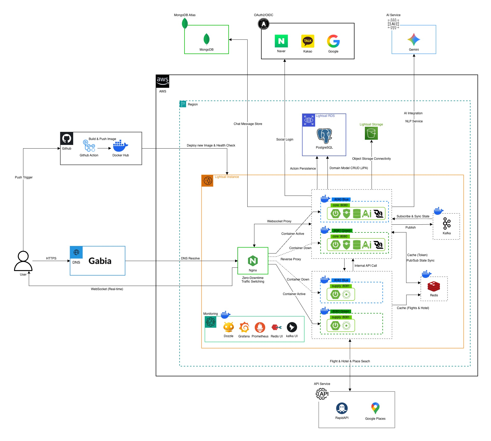

# Sofly BE

> AI 기반 그룹 여행 플래닝 서비스 Sofly의 백엔드 레포지토리

[]()
[]()

---

##  Table of Contents

1. [Team Members](#team-members)
2. [Features](#features)
3. [Architecture](#architecture)
4. [Tech Stack](#tech-stack)
5. [Getting Started](#getting-started)
6. [Environment Variables](#environment-variables)
7. [Project Structure](#project-structure)
8. [API Reference](#api-reference)
9. [Git Convention](#git-convention)
10. [Running Tests](#running-tests)
---

##  Team Members

|  |  |
|:---:|:---:|
| [박상민](https://github.com/sm010422) | [정세현](https://github.com/gitIt-sehyeon) |
| Backend | Backend |

---

##  Features

- **OAuth2 소셜 로그인** — Google, Kakao, Naver 연동 / JWT 기반 Stateless 인증
- **그룹 여행 워크스페이스** — 초대 코드로 멤버 초대, 항공권 저장 및 공유
- **AI 여행 플래너 채팅** — Google Gemini 기반 3단계 맞춤 여행 추천
- **여행 일정 관리** — 일정표 생성·편집·포크(복제), 아이템 추가
- **항공권·호텔 실시간 검색** — Booking.com RapidAPI 연동
- **장소 정보 조회** — Google Places API 기반 장소 검색 및 사진 제공
- **여행 앨범** — AWS S3 기반 사진 업로드·관리
- **여행 로그** — Markdown 기반 여행 기록 (공개 / 멤버 / 비공개 설정)
- **정복 지도** — 방문 국가·도시 기록, 공항 정보 조회

---

##  Architecture

이 프로젝트는 두 개의 독립적으로 배포되는 Spring Boot 서비스로 구성된 **멀티 모듈 모노레포**입니다.



---

```
┌───────────────────────────────────────────────────────────┐
│                        Client (Frontend)                   │
└───────────────┬───────────────────────────┬───────────────┘
                │                           │
                ▼                           ▼
┌───────────────────────┐     ┌───────────────────────────┐
│  travel-core-service  │────▶│  travel-supply-service    │
│  (Layered Arch)       │     │  (Hexagonal Arch)         │
│  :8080                │     │  :8082 (Docker)           │
│                       │     │                           │
│  - Auth / User        │     │  - 항공권 검색            │
│  - Workspace          │     │  - 호텔 검색              │
│  - Schedule           │     │  - 장소 정보 (Places)     │
│  - AI Chat            │     │                           │
│  - Album / TravelLog  │     │  Booking.com (RapidAPI)   │
│  - Conquest Map       │     │  Google Places API        │
└───────────────────────┘     └───────────────────────────┘
          │                               │
          └──────────────┬────────────────┘
                         ▼
              ┌─────────────────────┐
              │  PostgreSQL / Redis │
              └─────────────────────┘
```

**travel-core-service** — 레이어드 아키텍처. 인증·워크스페이스·일정·AI 채팅·앨범·여행 로그·정복 지도 등 핵심 비즈니스 로직을 담당합니다.

**travel-supply-service** — 헥사고날 아키텍처(Ports & Adapters). 외부 공급자 API(항공권·호텔·장소) 연동에 특화되어 있으며, `SupplierRegistry`가 `FlightSupplierPort` / `HotelSupplierPort` 구현체를 자동 탐지합니다. `supplier=<key>` 쿼리 파라미터로 런타임에 공급자를 선택할 수 있습니다.

---

##  Tech Stack

<table>
  <tr>
    <td width="50%" valign="top">
      <b>Language & Framework</b><br><br>
      
      
      
      
      
    </td>
    <td width="50%" valign="top">
      <b>Database & Cache</b><br><br>
      
      
    </td>
  </tr>
  <tr>
    <td width="50%" valign="top">
      <b>Authentication</b><br><br>
      
      
    </td>
    <td width="50%" valign="top">
      <b>AI</b><br><br>
      
      
    </td>
  </tr>
  <tr>
    <td width="50%" valign="top">
      <b>External API</b><br><br>
      
      
      
    </td>
    <td width="50%" valign="top">
      <b>Infra & Deployment</b><br><br>
      
      
      
    </td>
  </tr>
  <tr>
    <td width="50%" valign="top">
      <b>CI/CD</b><br><br>
      
    </td>
    <td width="50%" valign="top">
      <b>Build & Test</b><br><br>
      
      
    </td>
  </tr>
</table>

---

##  Getting Started

### Prerequisites

- Java 21
- Docker & Docker Compose
- 각 서비스의 `.env` 파일 (아래 [Environment Variables](#environment-variables) 참고)

### Installation

```bash
# 레포지토리 클론
git clone https://github.com/your-org/Sofly_Back.git
cd Sofly_Back
```

### Local Development

```bash
# 1. PostgreSQL, Redis 먼저 실행
docker compose -f docker-compose.local.yml up -d

# 2. 서비스 실행 (각각 별도 터미널)
./gradlew :services:travel-core-service:bootRun   # http://localhost:8080
./gradlew :services:travel-supply-service:bootRun  # http://localhost:8081
```

### Docker (전체 서비스)

```bash
# JAR 빌드 후 컨테이너 실행
./gradlew :services:travel-core-service:clean bootJar -x test
./gradlew :services:travel-supply-service:clean bootJar -x test
docker compose up -d
```

---

##  Environment Variables

각 서비스 루트에 `.env` 파일을 생성합니다 (`me.paulschwarz:spring-dotenv`로 자동 로드됩니다).

### travel-core-service

```dotenv
# Database
SPRING_DATASOURCE_URL=jdbc:postgresql://localhost:5432/sofly
SPRING_DATASOURCE_USERNAME=
SPRING_DATASOURCE_PASSWORD=

# Redis
REDIS_HOST=localhost
REDIS_PORT=6379

# JWT
JWT_SECRET_KEY=

# OAuth2 소셜 로그인
GOOGLE_CLIENT_ID=
GOOGLE_CLIENT_SECRET=
KAKAO_CLIENT_ID=
KAKAO_CLIENT_SECRET=
NAVER_CLIENT_ID=
NAVER_CLIENT_SECRET=
OAUTH2_REDIRECT_URI=http://localhost:3000/oauth2/callback

# AI
GEMINI_API_KEY=

# AWS S3 (앨범)
AWS_S3_ACCESS_KEY_ID=
AWS_S3_SECRET_ACCESS_KEY=
S3_BUCKET=
AWS_REGION=

# Inter-service
SUPPLY_SERVICE_URL=http://localhost:8081
```

### travel-supply-service

```dotenv
# Booking.com (RapidAPI)
RAPIDAPI_KEY=
RAPIDAPI_HOST=

# Google Places (선택 — 없으면 Places 기능 비활성화)
GOOGLE_PLACES_API_KEY=

# Redis
REDIS_HOST=localhost
REDIS_PORT=6379
```

---

##  Project Structure

```
Sofly_Back/
├── services/
│   ├── travel-core-service/              # 핵심 비즈니스 로직 (Port 8080)
│   │   └── src/main/java/com/sofly/core/
│   │       ├── global/                   # 공통 관심사
│   │       │   ├── ai/                   # Spring AI (Gemini 2.5 Flash)
│   │       │   ├── auth/                 # 토큰 재발급, 로그아웃
│   │       │   ├── security/             # JWT 필터, OAuth2 핸들러
│   │       │   ├── exception/            # 전역 예외 처리
│   │       │   └── response/             # 공통 응답 포맷 (ApiResponse)
│   │       └── domain/                   # 비즈니스 도메인
│   │           ├── user/                 # 사용자 프로필
│   │           ├── workspace/            # 워크스페이스, 멤버, 항공권 저장
│   │           ├── schedule/             # 여행 일정 및 아이템
│   │           ├── chat/                 # AI 여행 플래너 채팅
│   │           ├── album/                # 여행 앨범 (S3)
│   │           ├── travellog/            # 여행 로그 (Markdown)
│   │           └── conquest/             # 정복 지도 (방문 국가/도시)
│   │
│   └── travel-supply-service/            # 외부 공급자 API 연동 (Port 8081)
│       └── src/main/java/com/sofly/supply/
│           ├── adapter/
│           │   ├── inbound/rest/         # REST 컨트롤러
│           │   └── outbound/
│           │       ├── google/           # Google Places API 클라이언트
│           │       └── rapidapi/
│           │           ├── flights/      # Booking.com 항공권 어댑터
│           │           └── hotels/       # Booking.com 호텔 어댑터
│           ├── application/
│           │   ├── port/outbound/        # FlightSupplierPort, HotelSupplierPort 등
│           │   ├── service/              # 비즈니스 로직
│           │   └── dto/                  # 요청/응답 DTO
│           ├── bootstrap/                # SupplierRegistry (공급자 자동 탐지)
│           └── config/                   # WebClient, Redis 캐시 설정
│
├── docs/                                 # 운영 문서 (Nginx Blue-Green 등)
├── docker-compose.yml                    # 프로덕션
├── docker-compose.local.yml              # 로컬 인프라 (DB, Redis)
└── build.gradle
```

---

##  API Reference

### travel-core-service (`:8080`)

| 분류 | Method | Endpoint | 설명 |
|------|--------|----------|------|
| 인증 | `POST` | `/api/auth/refresh` | 액세스 토큰 재발급 |
| 인증 | `POST` | `/api/auth/logout` | 로그아웃 |
| 워크스페이스 | `POST` | `/api/v1/workspaces` | 워크스페이스 생성 |
| 워크스페이스 | `GET` | `/api/v1/workspaces/{id}` | 워크스페이스 조회 |
| 워크스페이스 | `POST` | `/api/v1/workspaces/{id}/invite` | 초대 코드 생성 |
| 일정 | `GET` | `/api/v1/schedules` | 워크스페이스 일정 목록 조회 |
| 일정 | `POST` | `/api/v1/schedules` | 일정 생성 |
| 일정 | `POST` | `/api/v1/schedules/{scheduleId}/fork` | 일정 복제 |
| 일정 | `POST` | `/api/v1/schedules/{scheduleId}/items` | 일정 아이템 추가 |
| AI 채팅 | `POST` | `/api/v1/chat/rooms` | 채팅방 생성 |
| AI 채팅 | `POST` | `/api/v1/chat/rooms/{roomId}` | AI에게 메시지 전송 |
| AI 채팅 | `GET` | `/api/v1/chat/rooms/{roomId}/messages` | 대화 내역 조회 |

Swagger UI: `http://localhost:8080/core/swagger-ui`

### travel-supply-service (`:8081`)

| 분류 | Method | Endpoint | 설명 |
|------|--------|----------|------|
| 항공권 | `GET` | `/supply/flights/offers` | 항공권 검색 (`?supplier=booking`) |
| 호텔 | `GET` | `/supply/hotels/offers` | 호텔 검색 (`?supplier=booking`) |
| 장소 | `GET` | `/supply/places` | 장소 텍스트 검색 (dev only) |
| 장소 | `GET` | `/supply/places/photo` | 장소 사진 URL 조회 (dev only) |

Swagger UI: `http://localhost:8081/supply/swagger-ui`

---

##  Git Convention

### Branch Strategy

Git Flow 전략을 기반으로 운영합니다.

| 브랜치 | 설명 |
|--------|------|
| `main` | 배포 가능한 상태 (Production) |
| `develop` | 다음 배포를 위한 통합 브랜치 |
| `feat/이슈번호-기능명` | 기능 개발 (`feat/12-social-login`) |
| `fix/이슈번호-버그명` | 버그 수정 (`fix/34-websocket-error`) |
| `hotfix/이슈번호-버그명` | 긴급 버그 수정 (main에서 분기) |

### Commit Message

```
type(scope): subject
```

| 태그 | 설명 |
|------|------|
| `feat` | 새로운 기능 추가 |
| `fix` | 버그 수정 |
| `refactor` | 리팩토링 (기능 변화 없음) |
| `chore` | 빌드 설정, 패키지 관리 등 |
| `docs` | 문서 수정 |
| `style` | 코드 포맷팅 (비즈니스 로직 변경 없음) |
| `test` | 테스트 코드 추가/수정/삭제 |
| `ci` | CI 구성 파일 및 스크립트 변경 |
| `perf` | 성능 개선 |

---

##  Running Tests

```bash
# 전체 테스트
./gradlew test

# 서비스별 테스트
./gradlew :services:travel-core-service:test
./gradlew :services:travel-supply-service:test

# 단일 테스트
./gradlew :services:travel-core-service:test --tests "com.sofly.core.ClassName.methodName"
./gradlew :services:travel-supply-service:test --tests "com.sofly.supply.ClassName.methodName"
```

---

##  License

This project is licensed under the MIT License.
